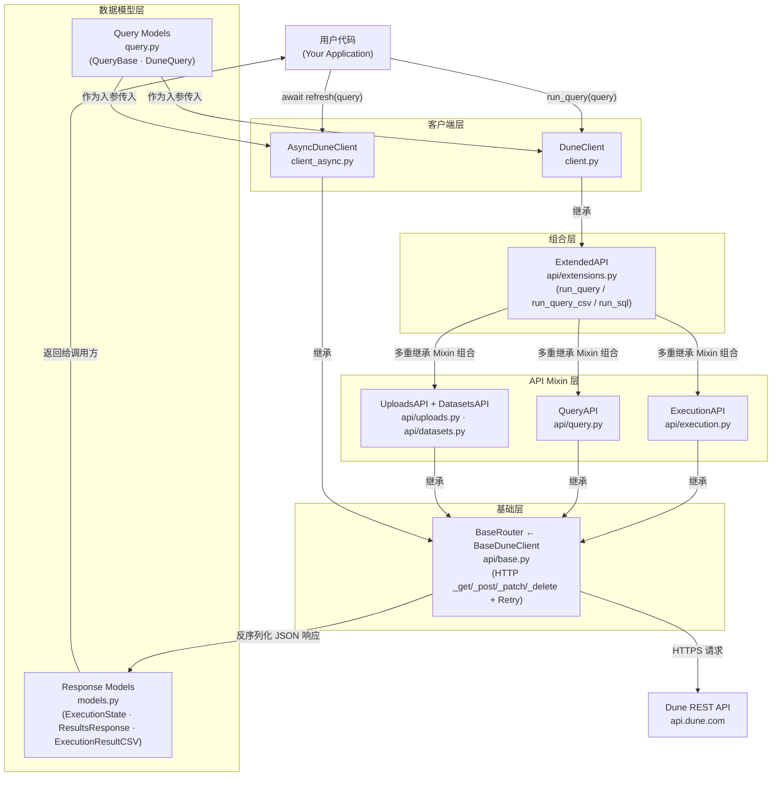

# Project Notes · dune-client

> Source: https://github.com/duneanalytics/dune-client
> Read on: 2026-06-11

## 1. 项目在做什么（一句话）

封装 Dune Analytics REST API 的 Python SDK，让用户一行代码完成链上数据查询并拿到结果。

---

## 2. 顶层架构图

---

## 3. 核心模块表

| 模块 | 路径 | 职责 | 关键文件 |
|---|---|---|---|
| BaseDuneClient / BaseRouter | `dune_client/api/base.py` | 鉴权配置、HTTP 方法封装（_get/_post/_patch/_delete）、自动重试 | `base.py` |
| ExecutionAPI | `dune_client/api/execution.py` | 触发执行、查询状态、拉取结果（含 CSV）的单端点薄包装 | `execution.py` |
| QueryAPI | `dune_client/api/query.py` | Dune Query 的 CRUD 操作（创建/读取/更新/归档） | `query.py` |
| UploadsAPI / DatasetsAPI | `dune_client/api/uploads.py` · `api/datasets.py` | 上传用户数据表、管理 Dataset | `uploads.py`, `datasets.py` |
| ExtendedAPI | `dune_client/api/extensions.py` | 通过多重继承组合所有 Mixin，提供 run_query / get_latest_result 等高级编排方法 | `extensions.py` |
| DuneClient | `dune_client/client.py` | 同步入口，继承 ExtendedAPI，公开给用户的最终类 | `client.py` |
| AsyncDuneClient | `dune_client/client_async.py` | 异步入口，基于 aiohttp，作为 async context manager 使用 | `client_async.py` |
| Query / Response Models | `dune_client/query.py` · `dune_client/models.py` | 输入输出数据结构（QueryBase、ExecutionState、ResultsResponse 等） | `query.py`, `models.py` |

---

## 4. 关键路径示例

用户动作：`client.run_query(query)` — 执行一条参数化查询并拿到全量结果

| 步骤 | 描述 | 文件 / 函数 |
|---|---|---|
| 1 | 构造查询对象，传入 query_id 和参数列表 | `query.py` · `QueryBase.__init__` |
| 2 | 调用顶层入口，校验参数互斥性 | `api/extensions.py` · `ExtendedAPI.run_query` |
| 3 | 序列化查询参数为 HTTP body 格式 | `query.py` · `QueryBase.request_format` |
| 4 | POST 触发执行，获得 execution_id | `api/execution.py` · `ExecutionAPI.execute_query` → `api/base.py` · `BaseRouter._post` → **HTTPS 网络 I/O** |
| 5 | 反序列化响应，校验 HTTP 状态码 | `api/base.py` · `BaseRouter._handle_response` → `models.py` · `ExecutionResponse.from_dict` |
| 6 | **[关键跳] 同步轮询状态**，每 1 秒 GET 一次，直到进入终止态 | `api/extensions.py` · `ExtendedAPI._refresh` (while loop) → `api/execution.py` · `ExecutionAPI.get_execution_status` → **HTTPS 网络 I/O** |
| 7 | 拉取首批结果（默认 32,000 行） | `api/execution.py` · `ExecutionAPI.get_execution_results` → `ExecutionAPI._get_execution_results_by_url` → `models.py` · `ResultsResponse.from_dict` |
| 8 | 分页循环，通过 next_uri 拼接全量数据 | `api/extensions.py` · `ExtendedAPI._fetch_entire_result` → `models.py` · `ResultsResponse.__add__` |
| 9 | 返回完整 ResultsResponse 给调用方 | `api/extensions.py` · `ExtendedAPI.run_query` return |

**异常分支 A**（HTTP 4xx/5xx）：`BaseRouter._handle_response` → `response.raise_for_status()`，429/502/503/504 先由 `Retry(total=5)` 自动重试。

**异常分支 B**（查询执行失败）：步骤 6 轮询到 `ExecutionState.FAILED` → `models.py` · `QueryFailedError(status.error.message)`。

---

## 5. 3 个可借鉴的设计点

1. **execute → poll → fetch 三段封装成单函数**：Dune API 是异步执行模型，提交、等待、拉结果三步天然分离。dune-client 用 `_refresh`（`api/extensions.py`）把轮询完全吞掉，对外只暴露 `run_query`，调用方零感知等待细节。落地到 signal vault：在 `src/lib/dune.ts` 里封装 `runDuneQuery(queryId, params)`，内部处理 execute → while poll → fetchAllPages 全流程，`POST /api/providers/[address]/refresh` 只需一句 `await runDuneQuery(DUNE_POLYMARKET_POSITIONS_QUERY_ID, { address })`。

2. **用"终止态集合"驱动状态机，替代散落的 if/else**：`ExecutionState.terminal_states()`（`models.py`）把所有结束状态收拢为一个 Set，轮询条件变成 `state not in terminal_states()`，新增终止态只改一处。落地到 signal vault：在 `src/types/index.ts` 里为订阅状态机（`IDLE → ... → SUBSCRIBED / FAILED`）定义 `TERMINAL_SUBSCRIBE_STATES = new Set([...])`,  `SubscribeButton` 里的 SWR 轮询传 `key = TERMINAL_SUBSCRIBE_STATES.has(state) ? null : url`，进入终止态自动停轮询。

3. **先查缓存年龄，再决定是否重新执行（max_age 惰性刷新）**：`get_latest_result`（`api/extensions.py`）先用 `limit=1` 拉一行探头，用元数据里的 `execution_ended_at` 与 `max_age_hours` 比较，过期才重跑，命中则直接拉全量。落地到 signal vault：`GET /api/providers/[address]` 里用 `date-fns` 的 `differenceInHours` 检查 `provider.metricsUpdatedAt`，超过 24h 才触发 Dune 重拉 + `metrics.ts` 重算并写回 DB，响应统一从 DB 读，读写分离，既保证时效又避免无谓 API 消耗。

---

## 6. 我的疑问 / 不确定的点

- `ExtendedAPI` 同时继承 8 个 Mixin（`ExecutionAPI, QueryAPI, UploadsAPI, DatasetsAPI, TableAPI, UsageAPI, CustomEndpointAPI, PipelineAPI`），Python MRO 如何保证方法冲突时的优先级？`UploadsAPI` 排在 `TableAPI` 前面是否就是为了让新方法覆盖同名废弃方法？这种 Mixin 顺序的工程约定是否有更显式的写法？

- signal vault 用 TypeScript，没有 Mixin 继承这种模式，最贴近"ExtendedAPI 组合所有 API slice"的 TS 写法是什么？是用 class + interface mixin、还是纯函数组合、还是直接把所有方法平铺进一个 class 更合适？
